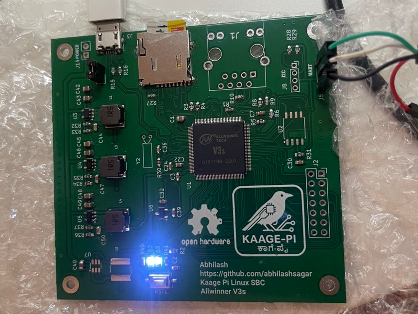

# Kaage Pi — A ₹2 K Linux SBC built from scratch
Booting Linux on a hand-soldered Allwinner V3s board.

---

## Why I Built It
I wanted to see if a usable Linux single-board computer could be built in India for under ₹2,000, using nothing more than open components, community knowledge, and hand-soldering tools.

Most of the SBCs we use today — Raspberry Pi, BeagleBone, etc. — are amazing.
I wanted to prove that we can build our own — from the ground up — using parts available locally, and learn how Linux truly runs on bare metal in the process.

That’s how Kaage Pi was born:
a home-soldered board built around the Allwinner V3s, an ARM Cortex-A7 SoC with 64 MB of integrated DDR2 RAM — powerful enough to boot Linux without any external memory.

This project isn’t about competing with Raspberry Pi.
It’s about understanding, experimenting, and inspiring others to start their own journey in open hardware — where you can hold a running Linux system that you built with your own hands.

If you’ve ever wondered “Can I really make my own Linux board?” —
the answer is yes, you can.
Start small, stay patient, and let curiosity lead.

---

### 🔗 Open Hardware Repository
👉 **Full open hardware source files available at [Kaage Pi GitHub Repository](https://github.com/abhilashsagar/Kaage-Pi).**

---

## Future Work
- Bring-up the LCD (Parallel RGB)  
- Enable Ethernet PHY and ping from Linux  
- Port LVGL on framebuffer   
- Work on SPI NOR flash 

---

## Resources & Tutorials That Helped

I learned a lot from open-source communities and amazing YouTube creators while building Kaage Pi.  
Here are a few that guided me through PCB design, power circuits, and Linux bring-up:

### Embedded Linux & SBC Design
- [Simon Richards – Allwinner V3S SBC](https://simonrichards.com/v3s/) – Detailed build of an SBC with Allwinner V3s, great reference.  
- [wtarreau – BreadBee: Build Your Own Single Board](http://wtarreau.blogspot.com/2020/09/breadbee-build-your-own-single-board.html) – Blog post covering the full hardware/software build of an open SBC.  
- [Popovicu – Making My First Embedded Linux System](https://popovicu.com/posts/making-my-first-embedded-linux-system/) – A beginner-friendly walk-through of embedding Linux on bare hardware.  
- [GitHub – balmerdx/AllwinnerV3S_KiCad](https://github.com/balmerdx/AllwinnerV3S_KiCad) – Open KiCad project for V3s boards, used as a layout reference and inspiration.
- [**Lichee Pi Zero – Sipeed Official Docs and Schematics**](https://linux-sunxi.org/LicheePi_Zero) – A fully open V3s-based SBC. Its documentation, boot logs, and community discussions helped immensely during Kaage Pi’s early bring-up.
  
## License
All schematics, layout files, and documentation © 2025 Abhilash Sagar  
Released under the [CERN OHL-S license](https://ohwr.org/project/cernohl/wikis/Documents/CERN-OHL-version-2).

---

### Follow my work
- [LinkedIn](https://www.linkedin.com/in/abhilashsagar/)  
- [GitHub @abhilashsagar](https://github.com/abhilashsagar)

